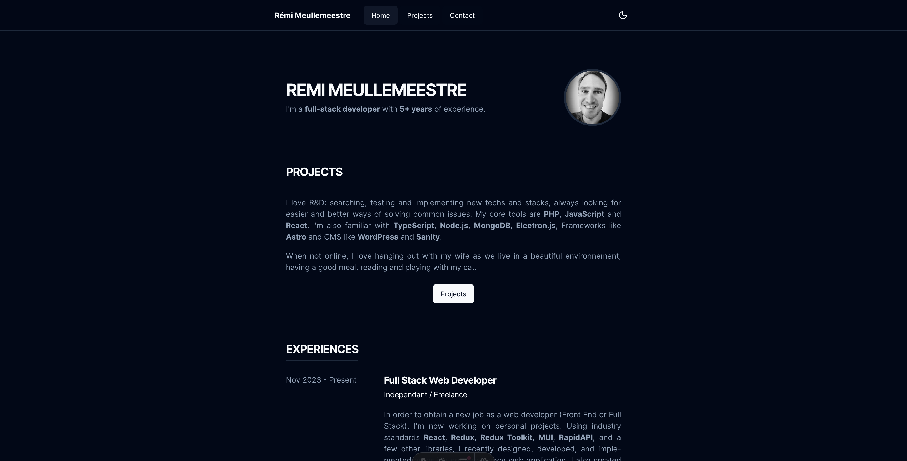

# Portfolio

[https://remimeullemeestre.dev](https://remimeullemeestre.dev)


## Description

Using the abilities and resources I was familiar with, I started my web development career by building a portfolio. The project is unquestionably out of date and has some bugs. I thought it was time to update my portfolio after five years, so here it is.

The app has a home page where I introduce myself, my experiences, and my skills. It also has a projects page where I showcase the important projects I've worked on, like this portfolio. Lastly, a contact page so you may get in touch with me.

It's a rather simple portfolio, using JAMstack, but it features a lot of cool technologies and tools.


[](https://remimeullemeestre.dev)

## Stack

- [Astro](https://astro.build) - Astro is a web framework that powers fast and dynamic websites, web apps, and APIs with automatic JS-to-HTML streaming and content-first architecture. Learn how to get started, explore themes, and join the community of Astro developers and users.
- [React.js](https://react.dev) - The library for web and native user interfaces. Build user interfaces out of individual pieces called components written in JavaScript. React is designed to let you seamlessly combine components written by independent people, teams, and organizations.
- [TypeScript](https://www.typescriptlang.org) - TypeScript is a strongly typed programming language that builds on JavaScript, giving you better tooling at any scale. Learn how to use TypeScript with editor checks, auto-complete, interfaces, JSX, const, and more.
- [Sanity](https://www.sanity.io) - Sanity is a platform that delivers content anywhere, gives you total composability, and syncs content with your business needs. Learn how Sanity powers content velocity, customer engagement, and innovation for digital leaders and brands.
- [Tailwind](https://tailwindcss.com) - Tailwind CSS is a framework that lets you build any design, directly in your HTML, with classes like flex, pt-4, text-center and rotate-90. It is easy to customize, scalable, and has a large community of adopters and creators who love its speed, flexibility and design-first approach.
- [Shadcn/ui](https://ui.shadcn.com) - shadcn/ui is a website that offers beautiful and customizable UI components that you can copy and paste into your apps. You can also access your GitHub repositories and issues from the website, and see the latest updates from other users.


## Project structure

```
$PROJECT_ROOT
│   # All the logic of the frontend
├── frontend
│     │   # Public assets like images (non processed files)
│     ├──public
│     │ # Entrypoint of the core logic of the frontend application
│     └──src
│        │   # Assets (image)
│        ├── assets
│        │   # Astro and React component files
│        ├── components
│        │   # Layouts component file
│        ├── layouts
│        │   # Utils functions
│        ├── lib
│        │   # Pages components
│        ├─ pages
│        │    │   # api connexion to Resend email service
│        │    ├── api
│        │    │  # Dynamic route folder for creating single post
│        │    ├── project
│        │    │  # Pages components
│        │    ├── blog.astro
│        │    ├── contact.astro
│        │    ├── index.astro
│        │    └── projects.astro
│        │
│        ├── layouts
│        │   # Custom hook files
│        ├── hooks
│        │   # Page files
│        ├── pages
│        │   # Sanity related files
│        ├── sanity
│        │   # Global styles
│        └── styles
│   # All the logic of the Sanity Studio
└── studio
      │   # Definitions of the Sanity schemas
      └── services

```

## V2

**Blog** - I've wanted to add a blog page since the beginning, so it will probably happen soon.